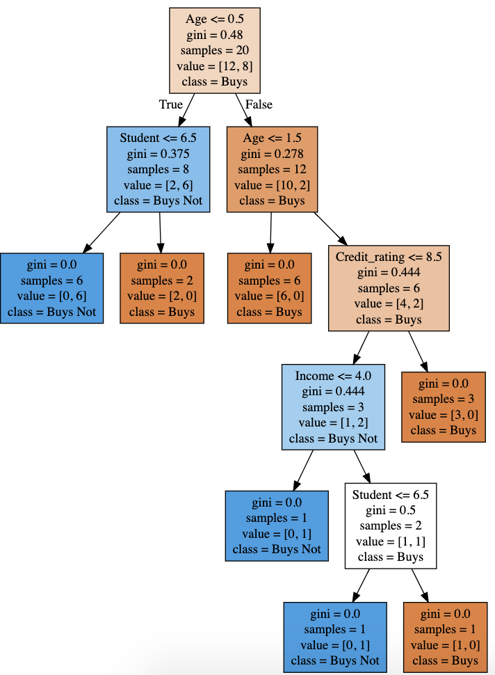

# Decision Trees Exercise

Do the exercise at the and of the LE. You can do the second part also in R if you want.
But somehow the results of the second part should be printable.
Again best you upload a PDF or the ref to Github or a Jupyter Notebook where everything can be seen with a minimum of clicks!

## Excercises DET

1. Find some data [here](https://drive.google.com/open?id=1E3bFrHnMGGmBgyAk9vAVnHGpQ8Z_asOP) on people. The goal is to decide if someone buys a computer or not. Derive the best decision tree by calculating a little by hand (Shannon). At least the first split.

2. Check your tree against the tree derived from SciKit Learn as given in the Python example before! Print the tree with Graphviz (can be easily done with [WebGraphViz](http://www.webgraphviz.com/))

## Result DET

[See result here](https://www.kaggle.com/carolineschneider/e11-decision-trees-exercise)

### Graph of second exercise

