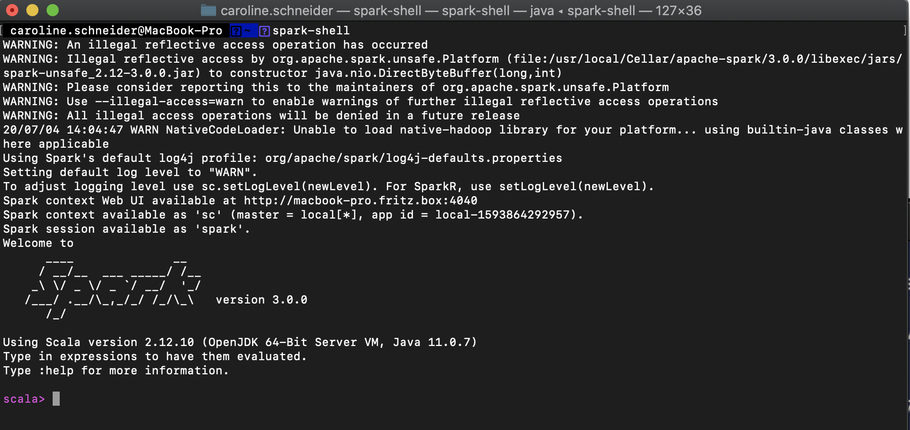

# Spark Basics Exercise

1) Install Spark. Explain how you installed. Did you experience any obstacles? How did you solve installation problems?

2) Download the complete Shakespeare writings from here, 

3) clean the file (there is some legal text at the beginning and in the file; you can do it by hand if needed)

4) search for the nr #24 most used word in his writings. Provide your code + result in one pdf, txt or by one github link in the comment section.

## Spark

### Terminal

```
brew cask install java 
```


 ```
brew install scala
```


 ```
brew install apache-spark
```


 ```
spark-shell
```




## Shakespeare

Note: Cleaned Text first and used [this one](./assets/shakespeare_cleaned.txt). 

[See notebook](https://github.com/mauschepano/data-science/blob/master/ea13/ea13-spark.ipynb)

