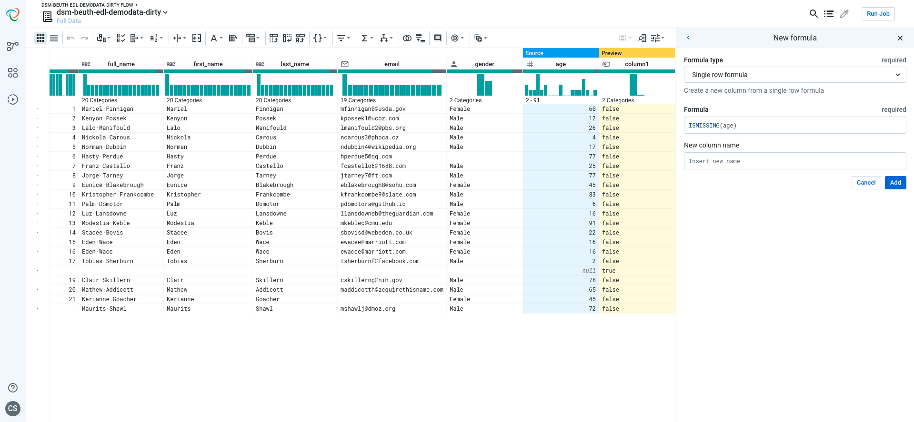
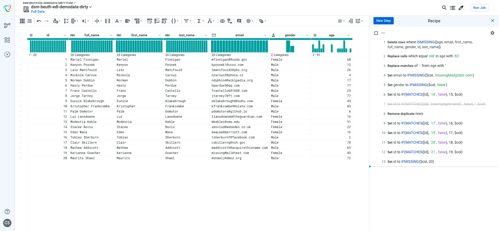

# Tool Supported Data Cleaning

1. Clean the dsm-beuth-edl-demodata-dirty.csv mini csv from the first exercise with Trifacta Wrangler (if you have no cloud access use the download version).
Not the red bars that give you instant feedback (on big datasets) where errors could be!
Create a recipie to clean the data as good as you can (it must not be a general script). Try to upload only one file (e.g. with screenshots and the end result).

2. Load the Grid_Disruption_00_14_standardized - Grid_Disruption_00_14_standardized.csv Dataset from Kaggle: 15 YEARS OF POWER OUTAGES. Where are errors here? How would you clean this file?

## 1. Upload CSV

## 1.  Creating a recipe to clean the data

## 1. Done

[Download new CSV](./assets/cleaned.csv)
